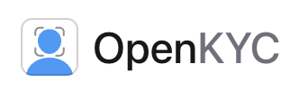
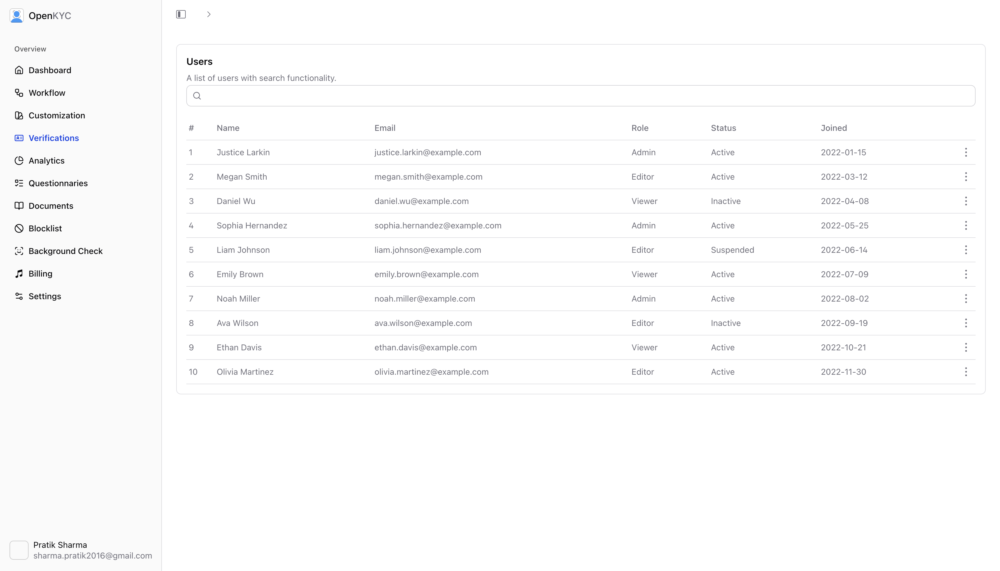

## OpenKYC

Build for the Tanstack Start [Hackathon](https://www.convex.dev/hackathons/tanstack)

KYC platform powered by Convex, tanstack start, [react-aria](http://intentui.com/), netlify, cloudflare, better-auth, autumn, resend, gemini. 

### Deployment

- `npx convex dev`
- `npx convex deploy`

### Environment Variables

- `CONVEX_DEPLOYMENT`
- `VITE_CONVEX_URL`
- `VITE_CONVEX_SITE_URL`
- `BASE_URL`
- `GITHUB_CLIENT_ID`
- `GITHUB_CLIENT_SECRET`
- `SITE_URL`
- `FIRECRAWL_API_KEY`
- `SENTRY_AUTH_TOKEN`
- `BETTER_AUTH_SECRET`
- `RESEND_API_KEY`
- `GEMINI_API_KEY`
- `AUTUMN_SECRET_KEY`

### Features

- Dashboard
- Verifications
- Analytics
- Workflows
- Customization
- Questionnairs
- Blocklist
  
- Manual Checks 
- Settings

## Convex Workflows

* Background check powered by firecrawl 
* Id verification powered by gemini 

user uploads documents -> status -> complete -> workflow -> extract data -> for Background Check 

## How it works 

user will create custom workflow, workflows include age verification, address verification, etc, 
then for verification users you can create custom session with workflow types, this session can be expired of live forever, one session can only collect information about one individual only. 

## Netflify deploy -> 
[DEMO URL](https://open-kyc.netlify.app)

Build logs:         https://app.netlify.com/projects/open-kyc/deploys/691481d57606b96a7af7abcf
Function logs:      https://app.netlify.com/projects/open-kyc/logs/functions
Edge function Logs: https://app.netlify.com/projects/open-kyc/logs/edge-functions

## Cloudflare  -> 
- https://tanstack-start-app.sharma-pratik2016.workers.dev/
- 

### References
- https://github.com/mikecann/port-geo-christmas-lights-cruise/tree/the-video-release
- https://convex-better-auth.netlify.app/framework-guides/tanstack-start
  
- https://github.com/firecrawl/firecrawl/tree/main/examples
- https://github.com/ericciarla/trendFinder
- https://github.com/tanstack/router/tree/main/examples
- https://github.com/get-convex/better-auth/tree/main/examples/tanstack
- https://github.com/abhik-99/Liveness-Detection
- https://modal.com/docs/examples/doc_ocr_jobs

### FAQ

  
<b>Why Open Source?</b>

  

    People keep asking me why open sourced this project because I wanted to use 
    <a href="https://www.coderabbit.ai" target="_blank">Coderabbit</a>
  

